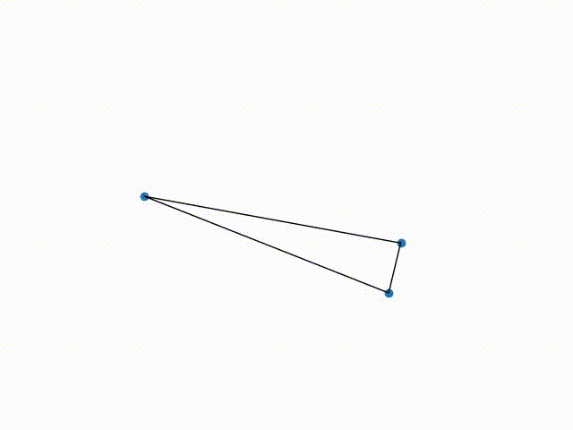

# Triangulate
Some useful functions for Delaunay triangulation

Author: 
&nbsp;&nbsp;&nbsp;&nbsp;Sourabh Bhat <heySourabh@gmail.com> 
&nbsp;&nbsp;&nbsp;&nbsp;[https://spbhat.in](https://spbhat.in)

--- 

Animation below shows incremental Delaunay triangulation with few randomly generated points:

